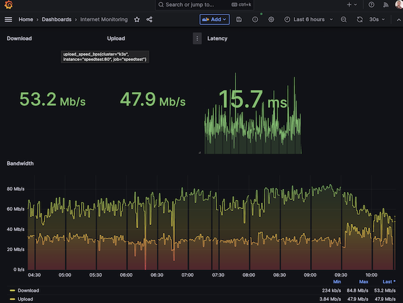

# Intro
Use [prometheus_speedtest](https://github.com/jeanralphaviles/prometheus_speedtest) and the [Grafana Agent](https://grafana.com/docs/agent/latest/) to send metrics of your internet connection to a prometheus instance and visualize it with grafana.

# Quick start
(Optional) Create a free Grafana Cloud Account to use the managed Prometheus and Grafana.

Replace URL, USERNAME and PASSWORD in [configmap.yaml](configmap.yaml) with the values of your prometheus instance, create the kubernetes resources and import [grafana.json](grafana.json) as dashboard.

Install the [Grafana Agent](https://grafana.com/docs/grafana-cloud/kubernetes-monitoring/other-methods/k8s-agent-metrics/#installing-grafana-agent-on-kubernetes) on your cluster in the same namespace.
